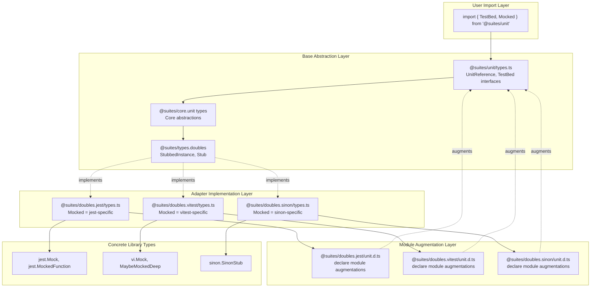
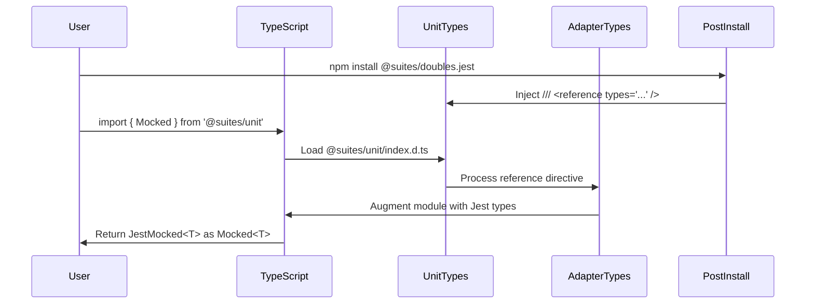
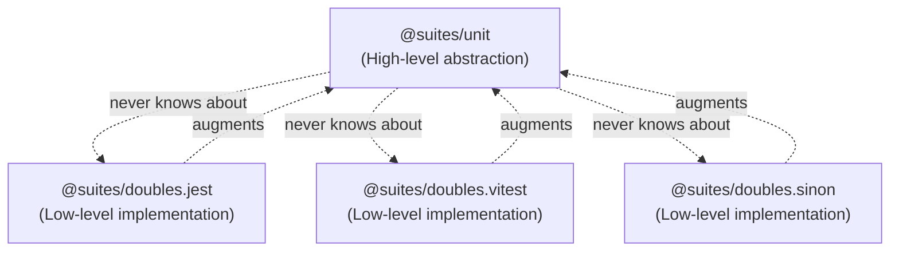
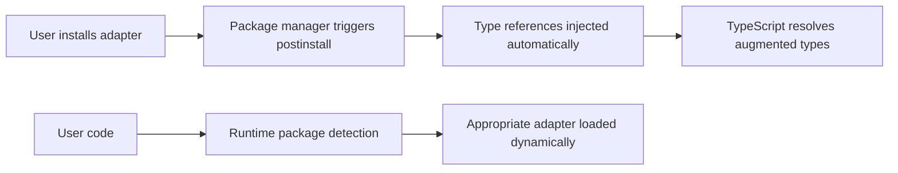
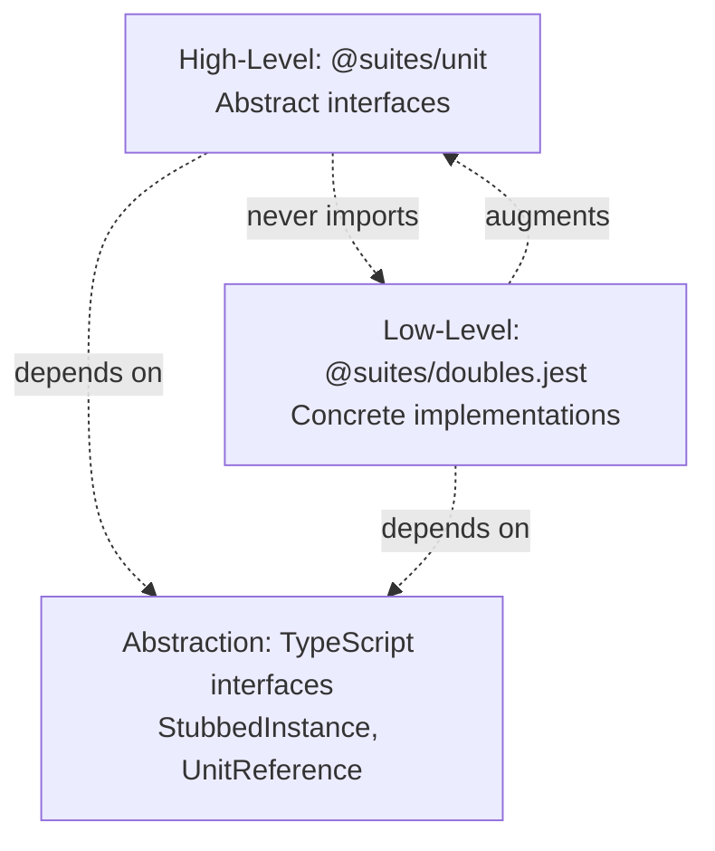

# Suites Framework - Abstraction & Module Augmentation Strategy

## Overview

Suites achieves its "import only from @suites/unit" design through a sophisticated TypeScript module augmentation system combined with automatic package discovery. This creates a seamless, zero-configuration developer experience while maintaining full type safety across different mocking libraries.

## The Module Augmentation Strategy

### **1. TypeScript Module Augmentation Pattern**

Suites uses **module augmentation** to dynamically extend the `@suites/unit` module with mocking library-specific types. Here's how it works:

```typescript
// In @suites/doubles.jest/unit.d.ts
declare module '@suites/unit/dist/esm' {
  export type Stub<TArgs extends any[] = any[]> = JestStub<TArgs>;
  export type Mocked<T> = JestMocked<T>;
}

declare module '@suites/core.unit/dist/esm' {
  export interface UnitReference {
    get<TDependency>(type: Type<TDependency>): JestMocked<TDependency>;

    // ... other Jest-specific overloads
  }
}
```

### **2. Dual Type Reference Strategy**

Suites provides **two complementary approaches** for type augmentation, giving users flexibility based on their project setup:

#### **Option A: Automatic PostInstall Injection (Preferred)**

The **postinstall scripts** automatically modify the main `@suites/unit` type definitions:

```javascript
// packages/doubles/vitest/postinstall.mjs
const newContent = '/// <reference types="@suites/doubles.vitest/unit" />\n';

// Prepends reference directive to @suites/unit/dist/*/index.d.ts files
const updatedData = newContent + data;
fs.writeFile(filePath, updatedData, 'utf8', ...);
```

This automatically injects: `/// <reference types="@suites/doubles.vitest/unit" />` at the top of the compiled type files.

#### **Option B: Manual Global Type Reference (Fallback)**

For projects where postinstall hooks don't work or users prefer explicit control, create a `global.d.ts` file:

```typescript
// global.d.ts in project root
/// <reference types="./unit" />   // For Jest
/// <reference types="@suites/doubles.sinon/unit" />  // For Sinon  
/// <reference types="@suites/doubles.vitest/unit" /> // For Vitest
```

This ensures type augmentation works even if automatic injection fails.

### **3. Layered Type System Architecture & Hierarchy**



## Type Hierarchy & The Abstraction/Augmentation Boundary

### **Understanding the Type Flow**

The genius of Suites lies in **where it draws the line** between abstraction and augmentation. Here's the detailed hierarchy:

#### **Layer 1: Base Abstractions (Pure Abstraction)**
```typescript
// @suites/types.doubles/index.ts - Generic, library-agnostic
export interface Stub<ReturnType, Args extends any[]> {
  (...args: Args): ReturnType;
}

export type StubbedInstance<TClass> = {
  [Prop in keyof TClass]: StubbedMember<TClass[Prop]>;
};
```

#### **Layer 2: Adapter-Specific Implementations (Concrete Implementation)**
```typescript
// @suites/doubles.jest/src/types.ts - Jest-specific concrete types
export type Mocked<T> = {
  [Key in keyof T]: T[Key] extends (...args: any[]) => any 
    ? jest.Mock<ReturnType<T[Key]>, Parameters<T[Key]>> & T[Key]
    : Mocked<T[Key]>;
};

// @suites/doubles.sinon/src/types.ts - Sinon-specific concrete types  
export type Mocked<T> = {
  [Key in keyof T]: T[Key] extends (...args: any[]) => any
    ? SinonStub<Parameters<T[Key]>, ReturnType<T[Key]>> & T[Key] 
    : Mocked<T[Key]>;
};

// @suites/doubles.vitest/src/types.ts - Vitest-specific concrete types
export type Mocked<T> = MaybeMockedDeep<T> & {
  [K in keyof T]: T[K] extends (...args: any[]) => any 
    ? VitestMocked<ReturnType<T[K]>> & T[K]
    : Mocked<T[K]>;
};
```

#### **Layer 3: Module Augmentation (The Bridge)**

```typescript
// @suites/doubles.jest/unit.d.ts - Bridges concrete to abstract
declare module '@suites/unit/dist/esm' {
   export type Stub<TArgs extends any[] = any[]> = JestStub<TArgs>;
   export type Mocked<T> = JestMocked<T>;  // JestMocked imported from ./types
}

declare module '@suites/core.unit/dist/esm' {
   export interface UnitReference {
      get<TDependency>(type: Type<TDependency>): JestMocked<TDependency>;

      //                                         ^^^^^^^^^^^^^^^^^^^^
      //                                         Concrete Jest type replaces 
      //                                         abstract StubbedInstance<T>
   }
}
```

### **The Critical Boundary Line**

**🎯 The Abstraction/Augmentation Line is Crossed at Module Declaration**

```typescript
// ✅ BEFORE LINE (Pure Abstraction) - Library agnostic
interface UnitReference {
  get<T>(type: Type<T>): StubbedInstance<T>;  // Generic abstract type
}

// 🔀 THE LINE (Module Augmentation) - Bridge mechanism
declare module '@suites/core.unit' {
  export interface UnitReference {
    get<T>(type: Type<T>): JestMocked<T>;  // Concrete library-specific type
  }
}

// ✅ AFTER LINE (Concrete Implementation) - Library specific
type JestMocked<T> = {
  [K in keyof T]: T[K] extends (...args: any[]) => any 
    ? jest.Mock<ReturnType<T[K]>, Parameters<T[K]>> & T[K]
    : JestMocked<T[K]>;
};
```

### **Why This Boundary Design is Brilliant**

#### **1. Separation of Concerns**
- **Abstract Layer**: Defines contracts and interfaces
- **Implementation Layer**: Provides library-specific concrete types
- **Augmentation Layer**: Bridges the two without breaking either

#### **2. Type Safety Preservation**
```typescript
// The user gets concrete types but through abstract interface
const mockDb: Mocked<Database> = unitRef.get(Database);
//            ^^^^^^^^^^^^^^^^  
//            Abstract interface, but TypeScript resolves to:
//            jest.Mock & Database (with Jest)
//            SinonStub & Database (with Sinon)
//            vi.Mock & Database (with Vitest)

mockDb.getUsers.mockResolvedValue([]);  // Library-specific methods available!
```

#### **3. Recursive Type Mapping**
Each adapter implements the same recursive pattern but with different base types:

```typescript
// Pattern: Map each property to library-specific mock + preserve original
type MockedProperty<T> = T extends (...args: any[]) => any 
  ? LibrarySpecificMock<T> & T    // Functions become mocks + original
  : Mocked<T>;                    // Objects recurse

export type Mocked<T> = {
  [Key in keyof T]: MockedProperty<T[Key]>;
};
```

### **4. Automatic Type Resolution Chain**

1. **User imports**: `import { TestBed, Mocked } from '@suites/unit'`

2. **Type reference injection** (via one of two methods):
   - **Automatic**: Postinstall hook injects reference into `@suites/unit` dist files  
   - **Manual**: User creates `global.d.ts` with explicit reference

3. **TypeScript resolution**: 
   - Loads `@suites/unit` base types
   - Processes `/// <reference types="@suites/doubles.jest/unit" />` 
   - Merges module augmentations from Jest adapter

4. **Result**: `Mocked<T>` becomes `jest.MockedFunction<T>` automatically

### **5. Key Benefits of This Approach**

#### **Single Import Point**
```typescript
// User only needs this one import regardless of testing library
import { TestBed, Mocked, Stub } from '@suites/unit';

// Not this mess:
// import { TestBed } from '@suites/unit';
// import { Mocked } from '@suites/doubles.jest';  
// import { JestAdapter } from '@suites/adapters.jest';
```

#### **Zero Configuration**
- No manual adapter registration
- No configuration files
- Package manager handles everything via postinstall hooks

#### **Type Safety Preservation**
```typescript
// The same code gets different but correct types based on installed adapters
const database: Mocked<Database> = unitRef.get(Database);

// With Jest: database is jest.MockedFunction<Database>  
// With Vitest: database is vi.MockedFunction<Database>
// With Sinon: database is sinon.SinonStub & Database
```

### **6. Implementation Pattern Details**

#### **Base Abstract Types**
```typescript
// packages/unit/src/types.ts - Base interfaces use generic types
export interface UnitReference extends UnitReferenceCore {
  get<TDependency>(type: Type<TDependency>): StubbedInstance<TDependency>;
}
```

#### **Adapter Augmentations Override Generics**
```typescript
// packages/doubles/jest/unit.d.ts - Concrete Jest types
declare module '@suites/core.unit' {
  export interface UnitReference {
    get<TDependency>(type: Type<TDependency>): JestMocked<TDependency>;
    //                                         ^^^^^^^^^^^^^^^^^^^^
    //                                         Overrides StubbedInstance<T>
  }
}
```

### **7. Runtime vs Compile-Time Separation**

- **Runtime**: Uses the PackageResolver pattern for actual adapter loading
- **Compile-time**: Uses module augmentation for type resolution
- **Both systems work independently but consistently**

## Postinstall Hook Mechanism

### **File System Modification Strategy**

```javascript
// Example from packages/doubles/vitest/postinstall.mjs
const filePaths = [
  path.join(__dirname, '..', 'unit', 'dist', 'esm', 'index.d.ts'),
  path.join(__dirname, '..', 'unit', 'dist', 'cjs', 'index.d.ts'),
];

const newContent = '/// <reference types="@suites/doubles.vitest/unit" />\n';

filePaths.forEach((filePath) => {
  fs.readFile(filePath, 'utf8', function (err, data) {
    const updatedData = newContent + data;
    fs.writeFile(filePath, updatedData, 'utf8', callback);
  });
});
```

### **Why This Dual Strategy Works**

1. **Automatic Execution**: npm/yarn automatically runs postinstall scripts
2. **Target Precision**: Modifies exact files TypeScript will load
3. **Non-Destructive**: Prepends reference without breaking existing content  
4. **Multiple Targets**: Handles both ESM and CommonJS distributions
5. **Fallback Support**: Manual `global.d.ts` works when postinstall fails (CI/CD, pnpm, etc.)
6. **User Control**: Some developers prefer explicit type declarations

## Type System Flow Examples

### **Jest Integration Flow**

```bash
# Step 1: User installs packages
npm install @suites/unit @suites/doubles.jest
```

```typescript
// Step 2: Type reference setup (automatic OR manual)
// OPTION A: Postinstall runs automatically (via Jest adapter's postinstall.js)
//           Injects: /// <reference types="@suites/doubles.jest/unit" />

// OPTION B: Manual setup in global.d.ts
/// <reference types="@suites/doubles.jest/unit" />

// Step 3: User imports (gets Jest-specific types)
import { TestBed, Mocked } from '@suites/unit';
//                  ^^^^^^ = jest.MockedFunction<T> & T

// Step 4: Runtime uses Jest adapter automatically
const { unitRef } = await TestBed.solitary(UserService).compile();
const mockDb: Mocked<Database> = unitRef.get(Database);
//            ^^^^^^^^^^^^^^^ = jest.MockedFunction<Database> & Database

mockDb.getUsers.mockResolvedValue([]);  // Jest-specific methods available
```

### **Vitest Integration Flow**

```bash
# Step 1: User installs packages  
npm install @suites/unit @suites/doubles.vitest
```

```typescript
// Step 2: Type reference setup (automatic OR manual)
// OPTION A: Postinstall runs automatically (via postinstall.mjs)
//           Injects: /// <reference types="@suites/doubles.vitest/unit" />

// OPTION B: Manual setup in global.d.ts  
/// <reference types="@suites/doubles.vitest/unit" />

// Step 3: Same user code, different types
import { TestBed, Mocked } from '@suites/unit';
//                  ^^^^^^ = vi.MockedFunction<T> & T

// Step 4: Runtime uses Vitest adapter automatically
const mockDb: Mocked<Database> = unitRef.get(Database);
//            ^^^^^^^^^^^^^^^ = vi.MockedFunction<Database> & Database

mockDb.getUsers.mockResolvedValue([]);  // Vitest-specific methods available
```

## Architecture Benefits Analysis

### **1. Developer Experience**

#### **Consistency Across Frameworks**
```typescript
// This exact code works with Jest, Vitest, Sinon - no changes needed
describe('UserService', () => {
  let userService: UserService;
  let database: Mocked<Database>;

  beforeAll(async () => {
    const { unit, unitRef } = await TestBed.solitary(UserService).compile();
    userService = unit;
    database = unitRef.get(Database);
  });

  test('should get users', async () => {
    database.getUsers.mockResolvedValue([mockUser]);
    const users = await userService.getAllUsers();
    expect(users).toEqual([mockUser]);
  });
});
```

#### **Intellisense & Type Safety**
- Full autocomplete for mocking library-specific methods
- Compile-time error detection
- Refactoring support across the entire test suite

### **2. Maintainability**

#### **Centralized Type Definitions**
- Base types in `@suites/unit/types.ts`
- Adapter-specific augmentations in separate files
- Clear separation of concerns

#### **Backward Compatibility**
- Adding new adapters doesn't break existing code
- Type augmentations are additive, not destructive
- Gradual migration paths between mocking libraries

### **3. Extensibility**

#### **New Adapter Creation Pattern**
```typescript
// 1. Create adapter implementation
// packages/doubles/newlib/src/index.ts
export const adapter = { mock: newlibMock, stub: newlibStub };

// 2. Create type augmentations  
// packages/doubles/newlib/unit.d.ts
declare module '@suites/unit' {
  export type Mocked<T> = NewlibMocked<T>;
}

// 3. Add postinstall script
// packages/doubles/newlib/postinstall.js
// (inject reference to unit.d.ts)

// 4. Register in PackageResolver
// packages/unit/src/testbed-builder.ts
export const SuitesDoublesAdapters = {
  // ...existing
  newlib: '@suites/doubles.newlib',
};
```

## Real-World Usage Patterns

### **Multi-Library Support**

```typescript
// package.json - Team can switch libraries without code changes
{
  "devDependencies": {
    "@suites/unit": "^3.0.0",
    // Change this line to switch entire test suite:
    "@suites/doubles.jest": "^3.0.0"     // Jest
    // "@suites/doubles.vitest": "^3.0.0" // Vitest  
    // "@suites/doubles.sinon": "^3.0.0"  // Sinon
  }
}
```

### **Framework Migration**

```bash
# Migrate from Jest to Vitest
npm uninstall @suites/doubles.jest
npm install @suites/doubles.vitest

# All tests continue working - only mock implementation changes
```

### **Monorepo Flexibility**

```typescript
// Different packages can use different mocking libraries
// packages/api/package.json
{ "devDependencies": { "@suites/doubles.jest": "^3.0.0" } }

// packages/ui/package.json  
{ "devDependencies": { "@suites/doubles.vitest": "^3.0.0" } }

// Same test patterns work across both packages
```

## Technical Implementation Details

### **Module Resolution Strategy**



### **Dual Resolution System**

#### **Compile-Time (Types)**
1. PostInstall script injects type references
2. TypeScript loads base types + augmentations  
3. User gets library-specific type signatures

#### **Runtime (Implementation)**
1. PackageResolver detects available adapter packages
2. Dynamic import loads actual adapter implementation
3. UnitMocker uses adapter for mock creation

### **Error Handling & Fallbacks**

```typescript
// Runtime adapter resolution with clear error messages
const adapterName = resolvers.find((resolverName: string) =>
  this.packageIsAvailable(this.adapters[resolverName])
);

if (!adapterName) {
  throw new AdapterNotFoundError(`
    No compatible adapter found. Please install one of:
    - @suites/doubles.jest
    - @suites/doubles.vitest  
    - @suites/doubles.sinon
    
    For more details: https://suites.dev/docs/overview/installation
  `);
}
```

## Architectural Analysis & Alternative Considerations

### **Core Architectural Principle: Proper Dependency Inversion**

The Suites architecture correctly implements **dependency inversion principle**:



**Key Principle**: The unit module remains **completely agnostic** and never imports or references any specific adapters. Only adapters know about and extend the unit's interfaces.

```typescript
// ✅ CORRECT: Unit stays pure and abstract
// @suites/unit/src/types.ts
export interface UnitReference {
  get<T>(type: Type<T>): StubbedInstance<T>; // Generic abstraction only
}

// ✅ CORRECT: Adapters know about and augment unit
// @suites/doubles.jest/unit.d.ts
declare module '@suites/unit' {
  export interface UnitReference {
    get<T>(type: Type<T>): JestMocked<T>; // Jest-specific override
  }
}

// ❌ WRONG: Would break dependency inversion
// @suites/unit/src/types.ts
import { JestMocked } from '@suites/doubles.jest'; // Never do this!
```

This maintains **clean separation of concerns** and **open/closed principle** - unit is open for extension (via module augmentation) but closed for modification.

### **Identified Architectural Risks & Mitigations**

#### **1. Postinstall Hook Reliability Issues**

**Current Risk**: File modification in node_modules can fail in various environments:
```javascript
// Potentially fragile approach
fs.writeFile(filePath, updatedData, 'utf8', callback);
```

**Alternative Solutions** (maintaining dependency inversion):

**Option A: Symlink Strategy**
```javascript
// postinstall.js - Create symlink instead of modifying files
const symlinkPath = path.resolve('../unit/adapter-types.d.ts');
const targetPath = path.resolve('./unit.d.ts');
fs.symlinkSync(targetPath, symlinkPath);
```

**Option B: TypeScript Project References**
```json
// Let TypeScript handle the references automatically
{
  "references": [
    { "path": "./node_modules/@suites/unit" },
    { "path": "./node_modules/@suites/doubles.jest" }
  ]
}
```

#### **2. Multiple Adapter Conflict Resolution**

**Current Risk**: Installing multiple adapters could create type conflicts:
```typescript
// Potential conflict scenario
declare module '@suites/unit' {
  export type Mocked<T> = JestMocked<T>;    // From Jest adapter
  export type Mocked<T> = VitestMocked<T>;  // From Vitest adapter - CONFLICT!
}
```

**Solution: Namespaced Augmentation Strategy**
```typescript
// @suites/doubles.jest/unit.d.ts
declare module '@suites/unit' {
  namespace Adapters {
    namespace Jest {
      interface UnitReference {
        get<T>(type: Type<T>): JestMocked<T>;
      }
    }
  }
  
  // Runtime detection determines which namespace to use
  export interface UnitReference extends Adapters.Jest.UnitReference {}
}
```

#### **3. The Side Effect Problem & Solution**

**Current Problem**: Postinstall scripts modify files in node_modules, creating side effects:
```javascript
// packages/doubles/jest/postinstall.js - PROBLEMATIC
const filePath = path.join(__dirname, '..', 'unit', 'dist', 'index.d.ts');
fs.writeFile(filePath, newContent + data, 'utf8', callback); // SIDE EFFECT!
```

**Issues with Current Approach**:
- **pnpm strict mode** prevents node_modules modifications
- **Docker layer caching** breaks when files change post-installation
- **CI/CD environments** may have read-only node_modules
- **Package integrity** violations

**Solution: Export Abstract Base Types**

Instead of relying on adapters to provide types via augmentation, unit should export its own abstractions:

```typescript
// @suites/unit/src/types.ts - Export base abstractions
export type Mocked<T> = StubbedInstance<T>; // Base abstract type
export type Stub<TArgs extends any[] = any[]> = StubbedFunction<TArgs>; // Base abstract type

export interface UnitReference {
  get<T>(identifier: Type<T>): Mocked<T>; // Uses own abstract type
}
```

```typescript
// @suites/doubles.jest/unit.d.ts - Augments the base types
declare module '@suites/unit' {
  // OVERRIDE the abstract with concrete implementation
  export type Mocked<T> = JestMocked<T>; // Replaces StubbedInstance<T>
  export type Stub<TArgs extends any[] = any[]> = JestStub<TArgs>; // Replaces StubbedFunction<TArgs>
}
```

**Benefits of This Approach**:
- ✅ **Zero side effects** - no file modifications during installation
- ✅ **Maintains DIP** - unit exports abstractions, adapters enhance them
- ✅ **Graceful fallback** - base types work without adapters installed
- ✅ **Universal compatibility** - works in pnpm, Docker, CI/CD, etc.
- ✅ **Eliminates postinstall dependency** - types available immediately

#### **4. Error Handling & Debugging Experience**

**Enhanced runtime adapter resolution**:
```typescript
const adapterName = resolvers.find((resolverName: string) =>
  this.packageIsAvailable(this.adapters[resolverName])
);

if (!adapterName) {
  const availableAdapters = Object.keys(this.adapters).map(name => 
    `- ${this.adapters[name]}`
  ).join('\n');
  
  throw new AdapterNotFoundError(`
    No compatible mocking adapter found.
    
    Please install one of the following:
    ${availableAdapters}
    
    Current environment detection:
    - jest: ${typeof jest !== 'undefined' ? '✓ available' : '✗ not found'}
    - vitest: ${typeof vi !== 'undefined' ? '✓ available' : '✗ not found'}
    
    For installation help: https://suites.dev/docs/installation
    For troubleshooting: https://suites.dev/docs/troubleshooting#adapter-detection
  `);
}
```

### **Abstraction & Augmentation Pattern Analysis**

The Suites architecture demonstrates **three complementary abstraction patterns** that work together while maintaining **Dependency Inversion Principle (DIP)** and **Inversion of Control (IoC)**:

#### **1. Interface Segregation via Module Augmentation**
```typescript
// Base abstraction (unit stays pure)
export interface UnitReference {
  get<T>(identifier: Type<T>): StubbedInstance<T>; // Generic contract
}

// Adapter-specific augmentation (respects DIP)
declare module '@suites/unit' {
  export interface UnitReference {
    get<T>(identifier: Type<T>): JestMocked<T>; // Concrete implementation
  }
}
```

**Key Insight**: The adapter **extends** the interface without the base knowing about it - classic **Open/Closed Principle**.

#### **2. Template Literal Types for Type-Safe Augmentation**
```typescript
// Enhanced adapter augmentation with better type safety
type MockableMembers<T> = {
  [K in keyof T]: T[K] extends (...args: any[]) => any ? K : never;
}[keyof T];

type MockMethods<T> = {
  [K in MockableMembers<T> as `${string & K}_mock`]: jest.MockedFunction<T[K]>;
};

// Adapter augments with enhanced type information
declare module '@suites/unit' {
  export interface UnitReference {
    get<T>(identifier: Type<T>): JestMocked<T> & MockMethods<T>;
  }
}
```

#### **3. Conditional Augmentation Based on Package Presence**
```typescript
// Abstract base - always present
export type StubbedInstance<T> = {
  [K in keyof T]: StubbedMember<T[K]>;
};

// Conditional augmentation - only when package installed
declare module '@suites/unit' {
  // This only applies if @suites/doubles.jest is installed
  export type Mocked<T> = T extends (...args: any[]) => any
    ? jest.MockedFunction<T> & T
    : { [K in keyof T]: Mocked<T[K]> };
}
```

### **Inversion of Control (IoC) Pattern Implementation**

The architecture implements **multiple levels of IoC**:

#### **Level 1: Package-Level IoC**


**Control Flow**: User's package choice **controls** which types and implementations are available.

#### **Level 2: Type-Level IoC** 
```typescript
// User doesn't control type resolution - package installation does
const database: Mocked<Database> = unitRef.get(Database);
//               ^^^^^^^^^^^^^^^^
//               Type determined by installed adapter package,
//               not by user's explicit choice in code
```

#### **Level 3: Implementation-Level IoC**
```typescript
// packages/core/src/services/dependency-resolver.ts
export class DependencyResolver {
  constructor(
    private adapter: DependencyInjectionAdapter,    // Injected via IoC
    private doublesAdapter: DoublesAdapter,         // Injected via IoC
  ) {}
  
  // Implementation controlled by injected adapters, not hardcoded
  resolveOrMock(identifier: InjectableIdentifier): unknown {
    return this.shouldMock(identifier) 
      ? this.doublesAdapter.mock()  // Adapter controls mock creation
      : this.instantiateClass(identifier);
  }
}
```

### **Alternative Abstraction/Augmentation Patterns Considered**

#### **1. Plugin-Based Abstraction (Rejected - Violates DIP)**
```typescript
// ❌ This would create tight coupling
import { TestBed } from '@suites/unit';
import { JestAdapter } from '@suites/doubles.jest';

TestBed.configure({ adapter: JestAdapter }); // Manual configuration required
```
**Why Rejected**: Violates DIP - unit would need to know about adapter types.

#### **2. Conditional Exports (Rejected - Compile-Time Only)**
```json
// ❌ This wouldn't provide runtime flexibility
{
  "exports": {
    ".": {
      "jest": "./dist/jest-types.d.ts",
      "default": "./dist/generic-types.d.ts"
    }
  }
}
```
**Why Rejected**: Fixed at build time, doesn't allow runtime adapter switching.

#### **3. Namespace-Based Augmentation (Alternative Pattern)**
```typescript
// ✅ This could work for multi-adapter scenarios
declare module '@suites/unit' {
  namespace Jest {
    interface UnitReference {
      get<T>(identifier: Type<T>): JestMocked<T>;
    }
  }
  namespace Vitest {
    interface UnitReference {
      get<T>(identifier: Type<T>): VitestMocked<T>;
    }
  }
  
  // Runtime determines which namespace to use
  export interface UnitReference extends Jest.UnitReference {}
}
```

#### **4. Generic Constraint Augmentation (Advanced Pattern)**
```typescript
// Base abstraction with constraint points
export interface UnitReference<TMockType = StubbedInstance<any>> {
  get<T>(identifier: Type<T>): TMockType extends StubbedInstance<infer U> ? TMockType : never;
}

// Adapter augments the constraint
declare module '@suites/unit' {
  export interface UnitReference<TMockType = JestMocked<any>> {
    // Inherits base behavior but with Jest-specific types
  }
}
```

### **DIP & IoC Validation: Why Current Approach Succeeds**

#### **1. Perfect Dependency Inversion**


**DIP Compliance**: 
- High-level module (unit) depends only on abstractions
- Low-level module (adapter) depends on abstractions + augments high-level
- **No direct dependencies between concrete modules**

#### **2. Multi-Level IoC Chain**
```typescript
// Level 1: Package Manager Controls Type Resolution
npm install @suites/doubles.jest  // User choice inverts control to package

// Level 2: TypeScript Controls Interface Augmentation  
declare module '@suites/unit' { ... }  // Compiler inverts control to adapter

// Level 3: Runtime Controls Implementation Loading
const adapter = await PackageResolver.resolve();  // Runtime inverts control to available packages

// Level 4: Dependency Injection Controls Mock Creation
constructor(private doublesAdapter: DoublesAdapter) {}  // DI container controls implementation
```

#### **3. Framework Agnostic Success**
```typescript
// Same code, different concrete types based on IoC chain
describe('UserService', () => {
  let userService: UserService;
  let database: Mocked<Database>; 
  //            ^^^^^^^^^^^^^^^^ 
  //            Type controlled by: package choice → type augmentation → runtime resolution

  beforeAll(async () => {
    const { unit, unitRef } = await TestBed.solitary(UserService).compile();
    //                                   ^^^^^^^^^^^^^^^^^^^^^^^^
    //                                   Implementation controlled by IoC chain
    userService = unit;
    database = unitRef.get(Database);
  });

  test('should get users', async () => {
    database.getUsers.mockResolvedValue([mockUser]); // Method availability controlled by adapter
    //                ^^^^^^^^^^^^^^^^^ 
    //                Concrete behavior injected via augmentation
    const users = await userService.getAllUsers();
    expect(users).toEqual([mockUser]);
  });
});
```

## Conclusion

This abstraction strategy represents a **sophisticated and architecturally sound** solution to the framework integration problem. The **dependency inversion principle** is correctly implemented, maintaining clean separation while providing seamless integration.

**Core Strengths:**
- **Proper dependency inversion** - unit stays pure, adapters extend
- **TypeScript module augmentation** for compile-time type resolution
- **Runtime package discovery** for implementation loading  
- **Zero configuration** - works out of the box
- **Full type safety** - complete IntelliSense support
- **Framework agnostic** - same API across libraries
- **Easy migration** - switch libraries without code changes

**Potential Improvements:**
- **More robust postinstall mechanisms** (symlinks vs file modification)
- **Better conflict resolution** for multiple adapters
- **Enhanced error messaging** for debugging
- **Advanced TypeScript features** for improved DX

This approach makes Suites feel like a "native" part of whatever testing stack you're using, while maintaining a consistent, intuitive API across all supported frameworks. It's a **masterclass in TypeScript module system usage, dependency inversion, and developer experience design**.